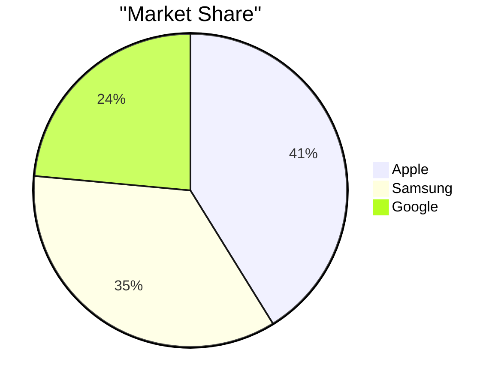

# Tables & Charts Feature Design

**Date:** 2026-04-27
**Status:** Approved
**Approach:** Native Markdown + Mermaid.js

## Overview

Add ability for the writer agent to create tables and charts in responses. The AI automatically decides when to use visualizations based on data context, while keeping the implementation simple and lightweight.

## Architecture

```
User Query
    ↓
Writer Agent (Gemma-3-12B-IT)
    ↓ (returns markdown + mermaid code blocks)
SSE Stream → Frontend
    ↓
MarkdownContent Component
    ├── detects | tables |
    └── detects ```mermaid blocks
         ↓
     Renders:
     ├── HTML Table (styled)
     └── Mermaid Chart (react-mermaid)
```

## Components

### MarkdownContent Extensions

**Current state:** Renders headers, lists, code blocks, bold text.

**New capabilities:**
1. **Table detection** — Find markdown table patterns (`| col | col |`)
2. **Mermaid detection** — Find code blocks marked `mermaid` or `chart`
3. **Render layers:**
   - Tables → Styled HTML table (clean borders, striped rows, responsive)
   - Mermaid → `<Mermaid>` component (lazy-loaded)

### Dependencies

```bash
npm install mermaid
```

**Bundle impact:** ~50KB gzipped

## Data Flow

1. User submits query
2. Router → Selector → Writer (existing flow unchanged)
3. Writer detects data need → outputs markdown + mermaid
4. SSE streams chunks to frontend
5. MarkdownContent receives accumulated content
6. On each render:
   - Regex detects table syntax
   - Regex detects ```mermaid blocks
   - Renders each accordingly

**No backend changes** except the writer prompt.

## Error Handling

**Mermaid failures:**
- Invalid syntax → Show fallback: "Chart unavailable (syntax error)"
- Timeout (chart too complex) → Fallback to raw code block display

**Table failures:**
- Malformed markdown → Render as plain text (don't break the message)

**Graceful degradation:** If mermaid fails to load or throws, charts show as code blocks instead of crashing.

## UI/UX

**Styling:**
- Tables: Clean borders, alternating row colors, responsive overflow-x
- Charts: Max-width constrained, center-aligned, subtle animations
- Mobile: Tables scroll horizontally, charts scale down

**Performance:**
- Lazy-load Mermaid component (only import when first chart detected)
- Debounce chart re-renders during streaming

## Writer Prompt Updates

Add to system prompt:

```
When presenting structured data, use these formats:

**TABLES** — For side-by-side comparisons or multi-row data:
| Feature | Plan A | Plan B |
|---------|--------|--------|
| Price   | $10    | $25    |
| Storage | 5GB    | 50GB   |

**CHARTS** — For visual data representation (use ```mermaid code block):
- Bar charts: Comparing values across categories
- Line charts: Trends over time
- Pie charts: Parts of a whole

Example bar chart:
```mermaid
xychart-beta
    title "Revenue by Quarter"
    x-axis ["Q1", "Q2", "Q3", "Q4"]
    y-axis "Revenue ($K)" 0 to 100
    bar [25, 40, 65, 80]
```

Example pie chart:


Use charts liberally when data allows. Tables for detail, charts for insight.
```

## Implementation Files

1. **app/page.tsx** — Extend MarkdownContent component
2. **app/api/chat/route.ts** — Update writer prompt

## Testing

1. Visual tests: Verify chart types render correctly (bar, line, pie)
2. LLM output testing: Sample queries and verify writer produces correct syntax
3. Streaming tests: Charts don't flicker or re-render excessively during stream
4. Edge cases: Empty tables, malformed mermaid, complex data
